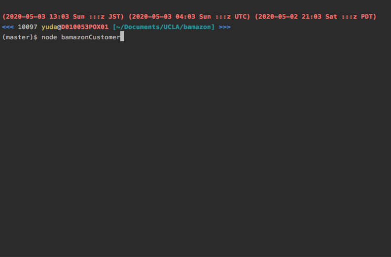
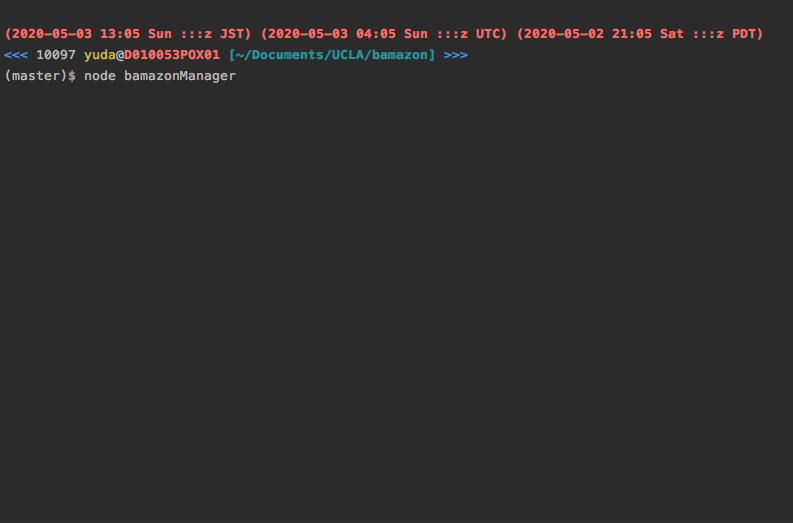
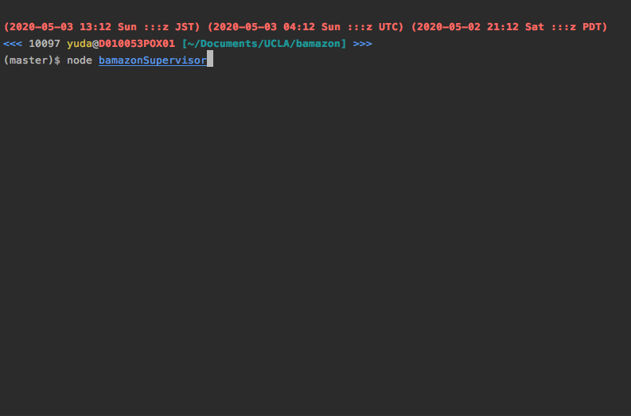

# Bamazon

### Overview
Amazon-like storefront with the MySQL. 
There are 3 parts to the app.

The 1st part, `bamazonCustomer` takes in orders from customers and deplete stock from the store's inventory. 

The 2nd part, `bamazonManager` shows products for sale, shows low inventory, adds to inventory, and adds new product.

The 3rd part, `bamazonSupervisor` shows product sales by department and creates new department.

### Links
- [Link to the code](https://github.com/yuda0110/bamazon)

### Tech/framework used

- JavaScript
- Node
- [mysql](https://www.npmjs.com/package/mysql)
- [inquirer](https://www.npmjs.com/package/inquirer)
- [console-table-printer](https://www.npmjs.com/package/console-table-printer)

### How to use the app
1. Go to the root directory of the app.
2. Run `npm install` in the terminal.
3. Type in one of the commands listed in the "What each command should do" section.

### What each command should do
#### 1. `node bamazonCustomer`

First, displays all of the items available for sale, which include the ids, names, and prices of products for sale.

Then, prompts users with two messages.

* The first will ask them the ID of the product they would like to buy.
* The second message will ask how many units of the product they would like to buy.

Once the customer has placed the order, the application will check if the store has enough of the product to meet the customer's request.

If not, the app will log a phrase like "There is not enough stock...", and then prevent the order from going through.

However, if the store does have enough of the product, it will fulfill the customer's order.

###### Demo

#### 2. `node bamazonManager`

It lists a set of menu options:

* View Products for Sale
* View Low Inventory
* Add to Inventory
* Add New Product

If a manager selects "View Products for Sale", the app will list every available item: the item IDs, names, prices, and quantities.

If a manager selects "View Low Inventory", then it will list all items with an inventory count lower than five.

If a manager selects "Add to Inventory", it will display a prompt that will let the manager "add more" of any item currently in the store.

If a manager selects "Add New Product", it will allow the manager to add a completely new product to the store.

###### Demo

#### 3. `node bamazonSupervisor`

This application will list a set of menu options:

* View Product Sales by Department
* Create New Department

When a supervisor selects "View Product Sales by Department", the app will display a summarized table in their terminal/bash window,
 which includes department_id, department_name, over_head_costs, product_sales, and total_profit.

When a supervisor selects "Create New Department", it will allow the supervisor to add a completely new department to the store. 

###### Demo

